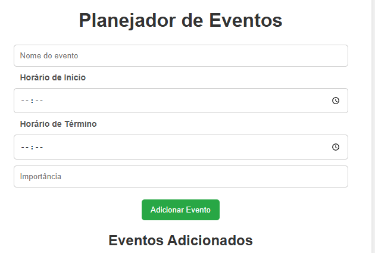
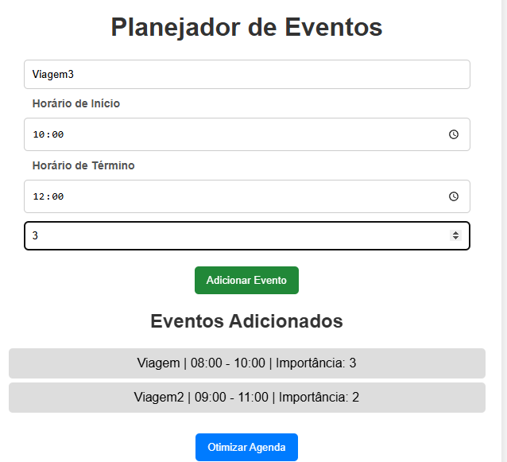
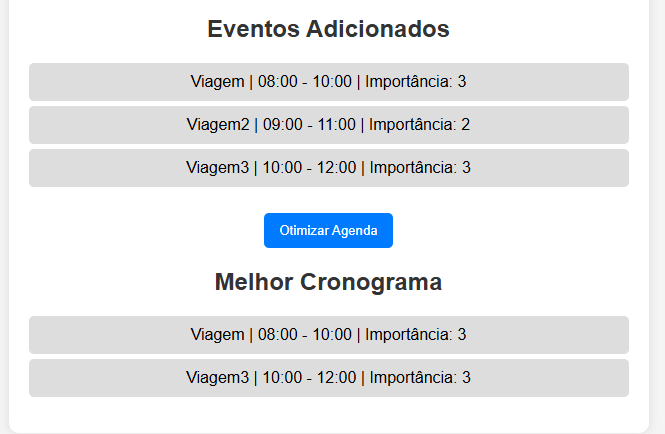

# Planejador de Eventos

**Número da Lista**: 5<br>
**Conteúdo da Disciplina**: Programação Dinâmica<br>

## Alunos

- Dupla 51

| Matrícula | Aluno                             |
| --------- | --------------------------------- |
| 190029692 | Igor Thiago Lima de Santana |
| 202017540 | Breno Soares Fernandes      |


## Sobre 
O **Planejador de Eventos Otimizado** é um sistema que ajuda usuários a organizar compromissos e eventos da melhor forma possível, maximizando a eficiência do tempo disponível.  

O projeto utiliza **Programação Dinâmica**, mais especificamente o algoritmo de **Weighted Interval Scheduling**, para escolher automaticamente a melhor combinação de eventos sem sobreposição, priorizando aqueles com maior importância.  

Com esta ferramenta, é possível organizar **reuniões, treinos, estudos ou qualquer outra agenda**, garantindo o máximo aproveitamento do tempo sem conflitos entre horários.  


## Screenshots







## Tecnologias Utilizadas  
**Linguagem**: JavaScript  
**Framework**: Nenhum (HTML, CSS e JS puro)  

## Vídeo

[Video](https://youtu.be/h9QKlfOIngs)

## Instalação  

Para utilizar o projeto, basta clonar este repositório e abrir o arquivo **index.html** em um navegador.  

Se preferir rodar um servidor local, utilize um servidor simples do Python:  

```bash
python -m http.server 8080

Depois, abra no navegador:
-> http://localhost:8080/